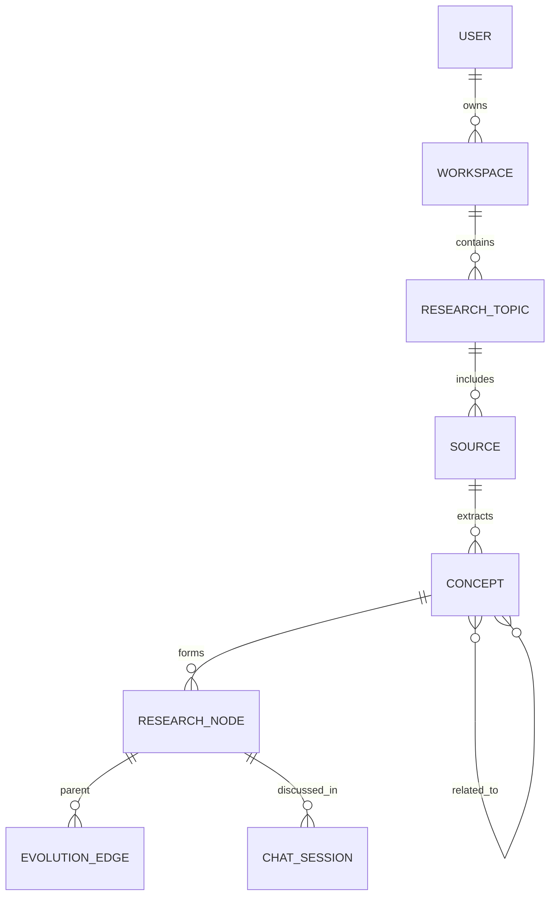
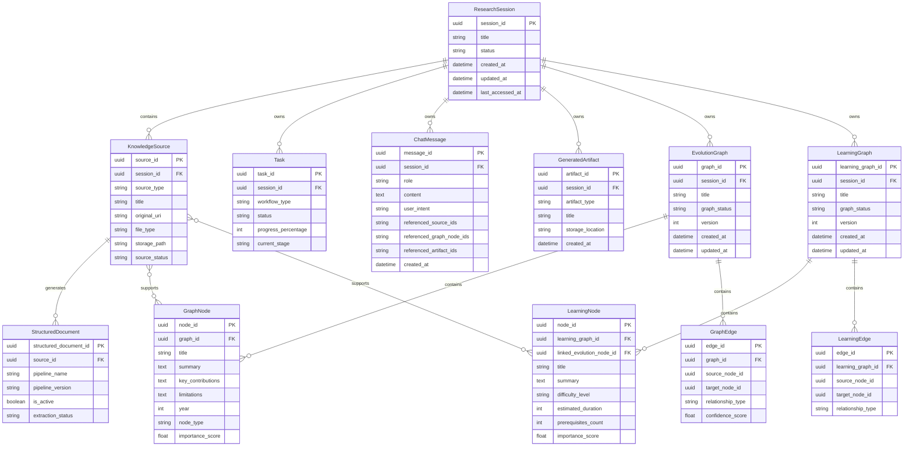

# Initial Conceptual Overview

```mermaid
erDiagram

    USER ||--o{ WORKSPACE : owns

    WORKSPACE ||--o{ RESEARCH_TOPIC : contains

    RESEARCH_TOPIC ||--o{ SOURCE : includes

    SOURCE ||--o{ CONCEPT : extracts

    CONCEPT ||--o{ RESEARCH_NODE : forms

    RESEARCH_NODE ||--o{ EVOLUTION_EDGE : parent

    RESEARCH_NODE ||--o{ CHAT_SESSION : discussed_in

    CONCEPT }o--o{ CONCEPT : related_to
```

```mermaid
erDiagram

    ResearchSession ||--o{ KnowledgeSource : contains
    ResearchSession ||--o{ Task : owns
    ResearchSession ||--o{ ChatMessage : owns
    ResearchSession ||--o{ GeneratedArtifact : owns
    ResearchSession ||--o{ EvolutionGraph : owns
    ResearchSession ||--o{ LearningGraph : owns

    KnowledgeSource ||--o{ StructuredDocument : generates

    EvolutionGraph ||--o{ GraphNode : contains
    EvolutionGraph ||--o{ GraphEdge : contains

    LearningGraph ||--o{ LearningNode : contains
    LearningGraph ||--o{ LearningEdge : contains

    KnowledgeSource }o--o{ GraphNode : supports
    KnowledgeSource }o--o{ LearningNode : supports

    ResearchSession {
        uuid session_id PK
        string title
        string status
        datetime created_at
        datetime updated_at
        datetime last_accessed_at
    }

    KnowledgeSource {
        uuid source_id PK
        uuid session_id FK
        string source_type
        string title
        string original_uri
        string file_type
        string storage_path
        string source_status
    }

    StructuredDocument {
        uuid structured_document_id PK
        uuid source_id FK
        string pipeline_name
        string pipeline_version
        boolean is_active
        string extraction_status
    }

    Task {
        uuid task_id PK
        uuid session_id FK
        string workflow_type
        string status
        int progress_percentage
        string current_stage
    }

    ChatMessage {
        uuid message_id PK
        uuid session_id FK
        string role
        text content
        string user_intent
        string referenced_source_ids
        string referenced_graph_node_ids
        string referenced_artifact_ids
        datetime created_at
    }

    GeneratedArtifact {
        uuid artifact_id PK
        uuid session_id FK
        string artifact_type
        string title
        string storage_location
        datetime created_at
    }

    EvolutionGraph {
        uuid graph_id PK
        uuid session_id FK
        string title
        string graph_status
        int version
        datetime created_at
        datetime updated_at
    }

    GraphNode {
        uuid node_id PK
        uuid graph_id FK
        string title
        text summary
        text key_contributions
        text limitations
        int year
        string node_type
        float importance_score
    }

    GraphEdge {
        uuid edge_id PK
        uuid graph_id FK
        uuid source_node_id
        uuid target_node_id
        string relationship_type
        float confidence_score
    }

    LearningGraph {
        uuid learning_graph_id PK
        uuid session_id FK
        string title
        string graph_status
        int version
        datetime created_at
        datetime updated_at
    }

    LearningNode {
        uuid node_id PK
        uuid learning_graph_id FK
        uuid linked_evolution_node_id FK
        string title
        text summary
        string difficulty_level
        int estimated_duration
        int prerequisites_count
        float importance_score
    }

    LearningEdge {
        uuid edge_id PK
        uuid learning_graph_id FK
        uuid source_node_id
        uuid target_node_id
        string relationship_type
    }
```