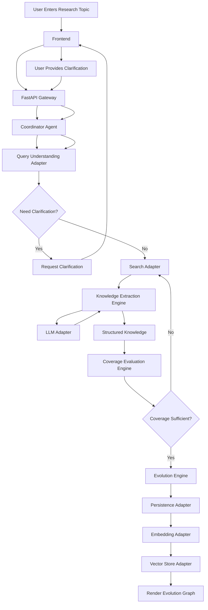
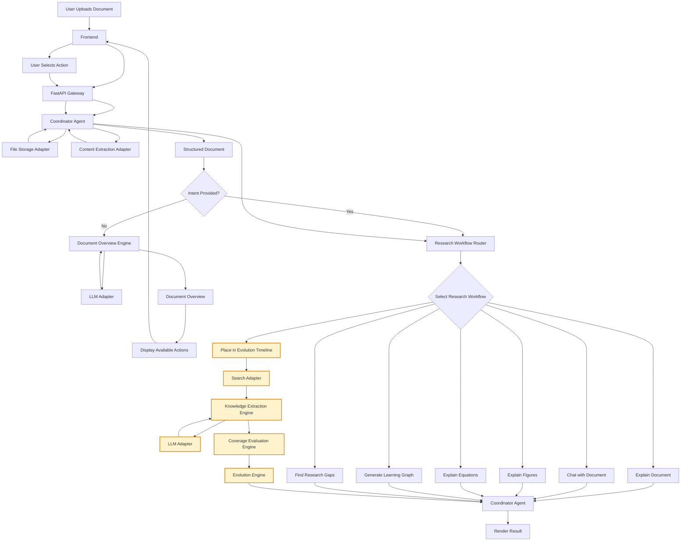

# Ratlas Sequence Flows

---

# SF-1 Explore Research Topic

## Participants

1. User
2. Frontend (React)
3. FastAPI Gateway
4. Coordinator Agent
5. Query Understanding Adapter
6. Search Adapter
7. Knowledge Extraction Engine
8. Coverage Evaluation Engine
9. LLM Adapter
10. Embedding Adapter
11. Vector Store Adapter
12. Knowledge Graph Adapter
13. Persistence Adapter
14. Evolution Engine

## Sequence

1. User enters a research topic and clicks **Generate**.
2. Frontend sends an HTTP POST request to the FastAPI Gateway.
3. FastAPI validates the incoming request.
4. FastAPI delegates the workflow to the Coordinator Agent.
5. Coordinator Agent sends the user query to the Query Understanding Adapter.
6. Query Understanding Adapter analyzes the query and returns a Query Understanding Result containing:
   - Original Query
   - Refined Query
   - Intent
   - Research Domain
   - Confidence Score
   - Status (PROCEED / NEED_CLARIFICATION)
7. If Status = NEED_CLARIFICATION: the Coordinator Agent returns a clarification request to the Frontend, and the workflow pauses until the user provides clarification.
8. If Status = PROCEED: the Coordinator Agent sends the Refined Query and Research Domain to the Search Adapter.
9. Search Adapter retrieves trusted and relevant knowledge sources and returns the collected search results to the Coordinator Agent.
10. Coordinator Agent sends the collected sources to the Knowledge Extraction Engine.
11. Knowledge Extraction Engine prepares the extraction tasks and sends them to the LLM Adapter. 
12. The LLM Adapter extracts structured research knowledge from the collected sources an returns it to the Knowledge Extraction Engine.
13. The Knowledge Extraction Engine validates, normalizes and consolidates the extracted knowledge before returning it to the Coordinator Agent
14. Coordinator Agent sends the extracted knowledge to the Coverage Evaluation Engine.
15. Coverage Evaluation Engine evaluates whether the collected knowledge sufficiently represents the evolution of the research topic.
16. If coverage is insufficient, the Coordinator Agent requests additional searches from the Search Adapter using the uncovered concepts, research gaps or underrepresented areas identified by the Coverage Evaluation Engine.
17. Steps 9–14 repeat until the Coverage Evaluation Engine determines that sufficient knowledge coverage is achieved or a configurable resource limit is reached.
18. Coordinator Agent sends the complete structured knowledge to the Evolution Engine.
19. Evolution Engine constructs a deterministic Evolution Graph.
20. Coordinator Agent sends the Evolution Graph to the Persistence Adapter for Storage.
21. Coordinator Agent sends the searchable content to the Embedding Adapter.
22. Embedding Adapter generates embedings and store them through the Vector Store Adapter.
23. Coordinator Agent returns the completed Evolution Graph to the Frontend.
24. Frontend renders the interactive Evolution Graph to the user.

---
## SF-1 Diagram

---

# SF-2 Upload Research Paper

## Participants

1. User
2. Frontend (React)
3. FastAPI Gateway
4. Coordinator Agent
5. File Storage Adapter
6. Content Extraction Adapter
7. Knowledge Extraction Engine
8. LLM Adapter
9. Coverage Evaluation Engine
10. Evolution Engine
11. Embedding Adapter
12. Vector Store Adapter
13. Persistence Adapter
14. Document Overview Engine
15. Reaserch Workflow Router
16. Search Adapter

## Sequence

1. User uploads a research document.
2. Frontend sends the uploaded document (and optional user prompt/intent) to the FastAPI Gateway.
3. FastAPI validates the request and delegates it to the Coordinator Agent.
4. Coordinator Agent stores the uploaded document through the File Storage Adapter.
5. File Storage Adapter returns the file reference.
6. Coordinator Agent sends the file reference to the Content Extraction Adapter.
7. Content Extraction Adapter extracts Structured Document and returns it to the Coordinator Agent.
8. Coordinator Agent checks whether the user has already provided an explicit intent.
9. If an explicit intent is provided:
   - Coordinator Agent sends the Structured Document and user intent to the Research Workflow Router.
10. If no explicit intent is provided:
    - Coordinator Agent sends the Structured Document to the Document Overview Engine.
    - Document Overview Engine prepares overview-generation tasks.
    - Document Overview Engine sends the request to the LLM Adapter.
    - LLM Adapter generates the semantic overview.
    - Document Overview Engine validates and assembles the final Document Overview.
    - Coordinator Agent returns the Document Overview and Available Actions to the Frontend.
    - User selects the desired action.
    - Frontend sends the selected action to the FastAPI Gateway.
    - FastAPI delegates the request to the Coordinator Agent.
    - Coordinator Agent sends the Structured Document and selected action to the Research Workflow Router.
11. Research Workflow Router selects the appropriate Research Workflow.
12. Selected Research Workflow executes the corresponding execution pipeline.
13. Coordinator Agent returns the final response to the Frontend.
14. Frontend renders the final result to the user.

## SF-2 Diagram

## Document Overview

Metadata
• Title
• Authors
• Publication Year
• Journal / Conference
• Research Domain

Document Summary
• Gist (3–5 lines)

Key Concepts
• 5–10 Concepts

Important Terminologies
• 5–10 Terms

Core Methodologies
• Major Methods / Algorithms

Research Contribution
• Problem Addressed
• Proposed Solution
• Remaining Limitations

Available Actions
• Explain Document
• Chat with Document
• Explain Figures
• Explain Equations
• Place in Evolution Timeline
• Generate Learning Path
• Find Research Gaps